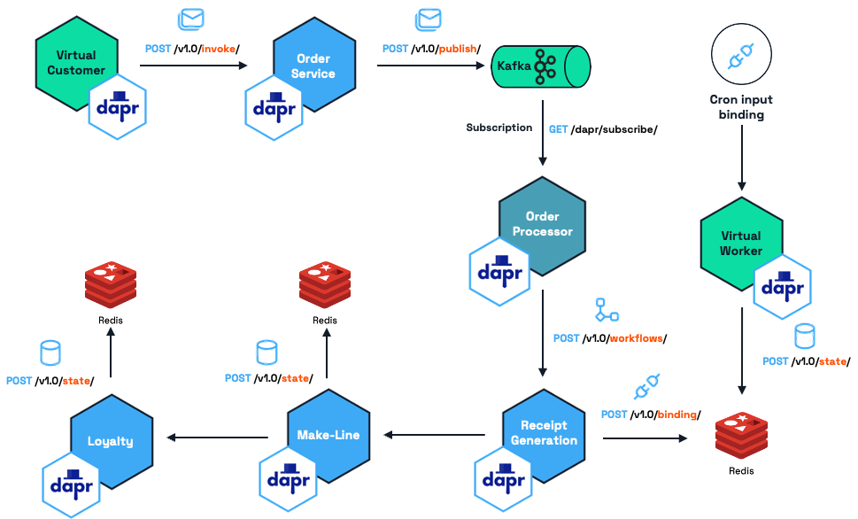

# Conductor Order Management System

A sample order management system composed of 8 Dapr-enabled microservices to showcase Conductor features.

## Architecture and Service Definitions




| Service          | Definition                                                                                                 | Dapr Component(s) |
|------------------|-------------------------------------------------------------------------------------------------------------| --------------------------------|
| Loyalty Service | Manages the loyalty program by modifying customer reward points based on spend | Kafka subscriber, Redis state store |
| Make Line Service | Responsible for simulating and coordinating a 'queue' of current orders. Monitors the processing and completion of each order in the 'queue' | Kafka subscriber, Redis state store |  
| Order Service | Basic CRUD API that is used to place and manage orders | Kafka publisher |
| Receipt Generation Service | Archival program that generates and stores order receipts for auditing and historical purposes  | Kafka subscriber, Redis output binding |
| Order Processor Workflow  | Responsible for orchestrating a workflow(Loyalty, Receipt, Make-Line) whenever an order is created.   | Kafka subscriber, Redis output binding, Dapr Workflow Client |
| Virtual Customer | 'Customer simulation' program that simulates customers placing orders | Order service invocation |
| Virtual Worker | 'Worker simulation' program that simulates the completion of customer orders | Cron input binding, Make-line service invocation | 

## Demo setup

See [Demo overview](./docs/01%20-%20Overview.md).

> If you plan to deploy the services locally in your own cluster, follow the instructions in [Local setup.md](./docs/09%20-%20Local%20setup.md). Skip the rest of the instructions below.

If you are a developer working on improving these services, keep following the instructions here.

## Development instructions

There are two development processes you can follow: 

 - [Development and deployment to local k8s cluster.](https://github.com/diagridio/conductor-demo-new/tree/demo-scenarios?tab=readme-ov-file#deployment-to-local-cluster-kindminikubeetc) 
 - [Development and run the services indivisually in your local machine (non-containerized)](https://github.com/diagridio/conductor-demo-new/tree/demo-scenarios?tab=readme-ov-file#running-dapr-services-locally-non-containerized).

## Deployment to local cluster (Kind/Minikube/etc)

### Prerequisites

- Kubernetes cluster of your choice (3+ nodes recommended)
- Helm

### Create application namespaces

After connecting to your cluster, run the following command to create the namespaces:

```bash
# create application namespaces
kubectl create ns order-system # Our services
kubectl create ns dapr-system # Dapr
kubectl create ns redis # Redis
kubectl create ns kafka # Kafka
kubectl create ns zipkin # Zipkin
```

### Install Dapr and create RBAC

```bash
dapr init -k -n dapr-system
kubectl apply -f ./components/k8s/dapr-secret-reader.yaml
```

### Setup metrics server

See more details at [Conductor pre-requisites](https://docs.diagrid.io/conductor/getting-started/prereqs/#installation-prerequisites).

```bash
kubectl apply -f https://github.com/kubernetes-sigs/metrics-server/releases/latest/download/components.yaml
kubectl patch deployment metrics-server -n kube-system --type "json" -p '[{"op": "add", "path": "/spec/template/spec/containers/0/args/-", "value": "--kubelet-insecure-tls"}]'
```

### Setup Helm

```bash
helm repo add bitnami https://charts.bitnami.com/bitnami
helm repo update
```

### Redis setup

Install Redis, export the password and create a secret that will be accessed from the component files.

```bash
helm install redis bitnami/redis -n redis
export REDIS_PASSWORD=$(kubectl get secret --namespace redis redis -o jsonpath="{.data.redis-password}" | base64 -d) 

kubectl create secret generic redis-password --from-literal=redis-password=$REDIS_PASSWORD -n order-system
```

### Kafka setup

Install Kafka, export the password and create a secret that will be accessed from the component files.

```bash
helm install --set persistence.enabled=false --set zookeeper.persistence.enabled=false --set auth.clientProtocol=sasl kafka bitnami/kafka -n kafka

export KAFKA_PASSWORD=$(kubectl get secret kafka-user-passwords --namespace kafka -o jsonpath='{.data.client-passwords}' | base64 -d | cut -d , -f 1)
kubectl create secret generic kafka-password --from-literal=kafka-password=$KAFKA_PASSWORD -n order-system
```

### Install Zipkin

Zipkin will be used for applicaiton tracing.

```bash
echo "Zipkin namespace created"
kubectl create deployment zipkin -n zipkin --image openzipkin/zipkin
echo "Zipkin deployment created"
kubectl expose deployment zipkin -n zipkin --type LoadBalancer --port 9411 
echo "Zipkin deployment exposed"
kubectl get svc -n zipkin -w
export ZIPKIN_DASHBOARD=$(kubectl get svc --namespace zipkin zipkin -o jsonpath="{.status.loadBalancer.ingress[0].ip}"):9411
echo "View tracing dashboard at $ZIPKIN_DASHBOARD"
```

### Important

Since we are inducing a component security advisory, update the content of `/components/k8s/oms.pubsub.yaml` with the new value for $KAFKA_PASSWORD. Redeploy the component.

Run `echo $KAFKA_PASSWORD` to retrieve the value.

### Deploy Dapr components

Now we will deploy the components that we will use throughout the demo:

```bash
kubectl apply -f ./components/k8s
```

### Manual deployments to k8s during development

For manual deployments, use the deployment files in `deployment-files/k8s-dev`. Modify the images within the deployment files with your own IMAGE:TAG.

> The folder `deployment-files/k8s` is used exclusively by deployments triggered by pushes to the main branch.

#### Build and push docker images to the development registry individually.

Inside each service folder there is a Makefile. Navigate to the folder. modigy the contents of the Makefile to deploy the images to your own registry and run the command below to build and push the images. 

For example, to build and push the `order-service` image, run:

  ```bash
  cd go/order-service
  make build_image
  ```

## Running Dapr services locally (non-containerized)

Running the services in your computer will be simpler, as we won't depend on k8s, Helm, and Kafka.

### Pre-requisites

- Go version 1.20
- .NET Core 8
- Python 3.11
- Docker
- Dapr 1.13.2

### Deploy Dapr components

First we will deploy the components that we will use throughout the demo:

```bash
kubectl apply -f ./components/local
```

### To test the services locally, you can run the following command: 

```bash
cd go/order-service
make run
``` 

## CI/CD Information

## GitHub Actions

Every push to the main branch will trigger a process that builds and publishes a new image tagged with the commit SHA. The image is deployed to two GKE clusters after that. For details on teh clustes, see [Demo overview](./docs/01%20-%20Overview.md).

[Kustomize](https://kustomize.io/) is used to create the deployments dynamically.

## About container architecture

The containers are currently built for both ARM and AMD64 architectures. 

