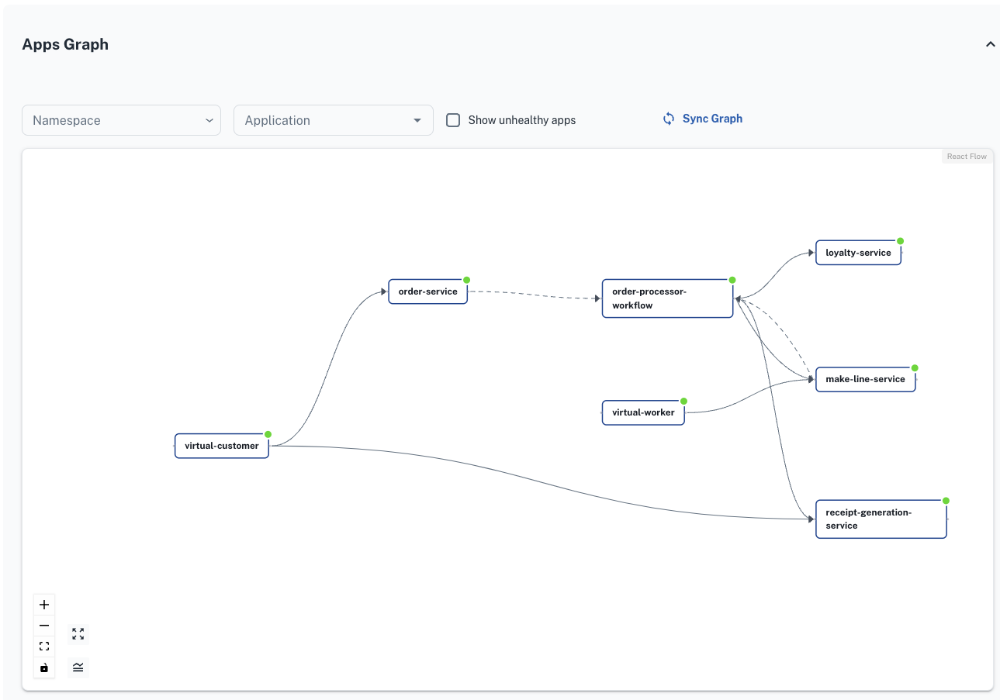

# App Graph 

## View the application graph

Applications list shows all the Dapr-enabled apps and infrastructure components running on the cluster. Important Dapr properties such as app-id, health status (combining both app and sidecar container), app port and resource data can be seen here. Option to rollout each of these. Viewing the Dapr version can be handy here to ensure that all apps haven rolled out and are the same as control plane version.

Clicking on `Apps Graph` shows a graphical view of the Dapr applications running and how they communicate in the cluster. Each app can be `isolated` for additional details and the app icons can also be dragged around for easier viewing.
- Solid lines denote service invocation between apps
- Dotted lines denote pubsub
- Green apps are healthy, yellow: degraded, red: unhealthy, grey: unknown
- Isolating apps shows metrics data and infrastructure information of the connected Dapr components
- All orange boxes are Dapr components.

Isolate on the `order-service` to view metrics from it publishing orders to the `oms.pubsub` message broker to a number of subscribers. Isolate on `oms.pubsub` to see all metrics of connected apps that are communicating with the broker. The metrics shown are in near-realtime and are *not* using Dapr tracing configurations but instead just the Dapr metrics data scraped from the Prometheus endpoint on each Dapr sidecar. 

-> Isolating `virtual-customer` will present a service invocation error tom `receipt-generation-service`. This error is detailed at [Service invocation error](./08%20-%20Induced%20errors.md). 

-> Clicking on `receipt-generation-service` shows the metrics from the message broker to the subscribing receipt service and it failing to output the receipt to `oms.binding.receipt` by drawing the edge as red. This error is detailed at [Redis Binding Error](./08%20-%20Induced%20errors.md).

-> Click on the link button next to the `receipt-generation-service` to navigate to the app-specific view.

**Next:** [Application View](./06%20-%20Application%20view.md)