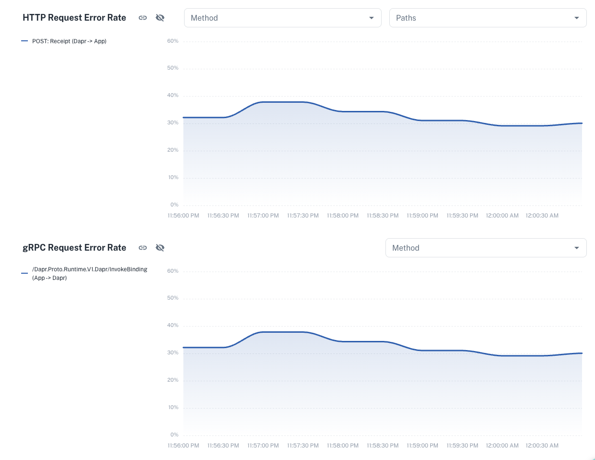
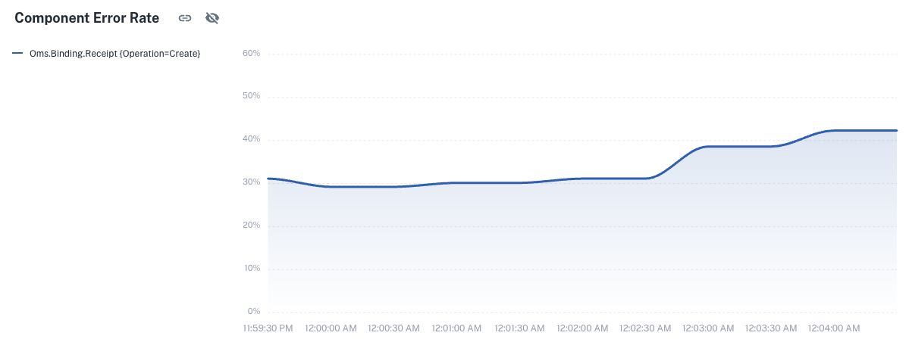
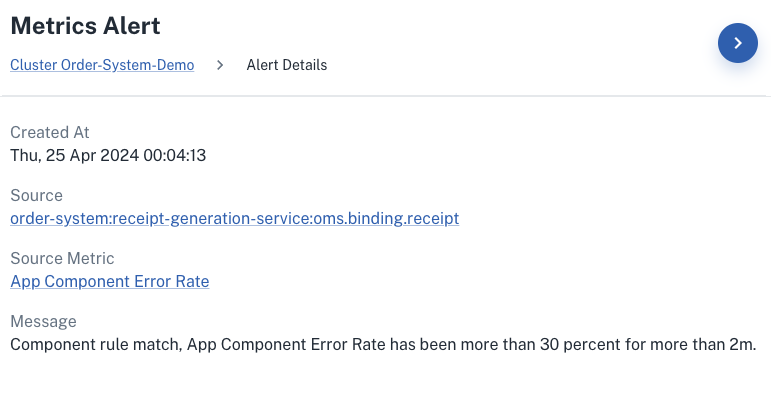

# App-specific view

## Receipt Generation Service App Summary:
Dapr specific properties for an app on your cluster including name (app-id), active components (used in the past 5 minutes), health (including both app and Dapr sidecar containers) and the annotations (by clicking on `More Info`).

Near realtime resource information like CPU and memory resources including the percentage of memory and CPU used compared to the CPU request and memory limit values. You can also see a breakdown of Dapr and App resource usage over time in the graphs.

-> Throughputs page shows the golden metrics graphs over time. For instance the latency, throughput and error rate for both Dapr HTTP and gRPC calls broken down by API calls.

Notice that digging into the `receipt-generation-service` you will see a high error rate for the `HTTP Request Error Rate` and `gRPC Request Error Rate` graphs. Specifically the call to the Redis output binding from the app seems to be failing ~30% of the time.  [Redis Binding Error](./08%20-%20Induced%20errors.md).

- Looking at the Dapr Components enabled for the Receipt Generation Service, I have a Redis output binding and a Kafka pubsub broker scoped to this app.
    - Scroll down on the components page to notice that there is a high component error rate (~30%).

-> Navigating to the Notifications tab within the app shows the logs error many times from the Dapr sidecar logs. All Dapr sidecar logs of levels error, warning and fatal are collected and shown in this page.

Filter on `metrics` to see what default metrics rules are being triggered for this application. A combination of the following default metrics rules should be firing:
- App Component Error Rate has been more than 30 percent for more than 2m
- App to Dapr GRPC Error Rate has been more than 30 percent for more than 2m
- App to Dapr HTTP Error Rate has been more than 30 percent for more than 2m

-> Navigate to the Notifications blade and click on `Rules` in order to see what alerts are created in the organization by default. Can also create your own rules based on the criteria of your apps and send to channels using webhooks, email and of course, the Conductor dashboard.

## Loyalty Service App Summary:

The `loyalty-service` also provides good insights on component failures. More details at [Component initialization error](./08%20-%20Induced%20errors.md).

**Next:** [Upgrade Dapr](./07%20-%20Upgrade%20Dapr.md)