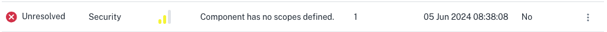

# Demo Scenario - Component Misconfiguration

## Overview

This scenario showcases the following components issues:

- `components/oms.state.loyalty-fail.yaml` - containing a malformed `redisHost` value.
- `components/oms.state.unscoped.yaml` - unscoped component.
- `components/oms.state.wrongscope.yaml` - scoped with a nonexistent app-id.

## Where can you see this error?

**Misconfigured component:**

This can be detected in the _Component Insights_ section:


You can check the component yaml file to easily detect the error:


**Unscoped Component:**

Within the Advisors tab, under security, you can see the advisory `Component has no scopes defined.`

**Component scoped to nonexistent app-id:**



## How to fix it

To fix this issue, comment out the file `components/oms.state.loyalty-fail.yaml` and uncomment the content in `components/oms.state.loyalty.yaml`. Then run the command below to apply the configurations and wait a few seconds for the error to disappear.

```bash
kubectl apply -f components/k8s
```

**Next:** [Demo scenario - Service Invocation](./09%20-%20Service%20Invocation.md)
