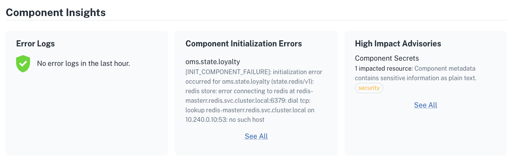
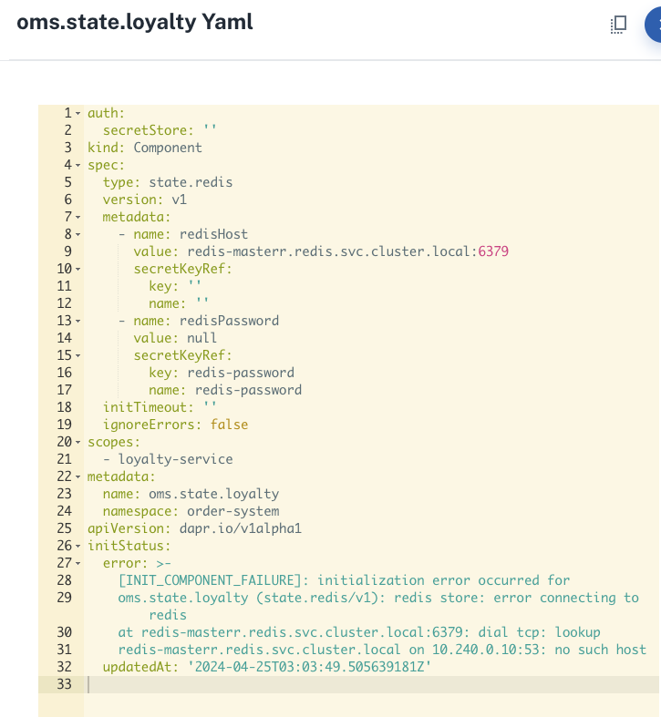

# Demo Scenario - Component Misconfiguration

## Overview 

This error showcases a misconfigured component - `components/oms.state.loyalty-fail.yaml` - containing a malformed `redisHost` value. 

## Where can you see this error?

This can be detected in the _Component Insights_ section:



You can check the component yaml file to easily detect the error:



## How to fix it

To fix this issue, comment out the file `components/oms.state.loyalty-fail.yaml` and uncomment the content in `components/oms.state.loyalty.yaml`. Then run the command below to apply the configurations and wait a few seconds for the error to disappear. 

```bash
kubectl apply -f components/k8s
```
