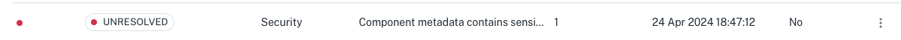
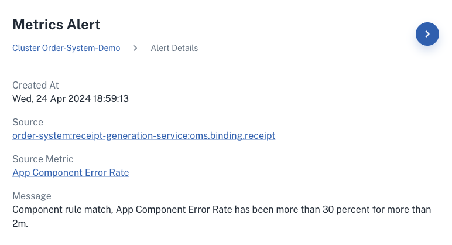
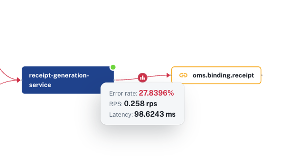
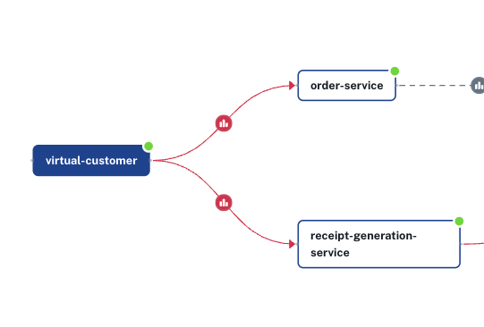

# Showcasing errors

The solution contains multiple induced errors that can be displayed and some can be fixed in real-time.

## Reliability issue - Component is offline [Configuration needed]

### Overview
A component (kafka) is suddenly offline.

### How to trigger

On a terminal run the following command to set the number of kafka replicas to 0:

```
kubectl scale statefulset kafka-controller --replicas=0 -n kafka
```

### Where can you see this error?

**`Components` tab**


**App Summary - `order-service` Insights**


**App Summary - gRPC Request Error Rate on `order-service`** 


**App Notifications**


**App Graph**

TODO: ADD WORKING SCREENSHOT

### How to fix this error?

On a terminal run the following command to set the number of kafka replicas to 3:

```
kubectl scale statefulset kafka-controller --replicas=3 -n kafka
```

## Security issue - Component configuration [Already induced in YAML]

### Overview 
Component metadata(Kafka pubsub) contains sensitive information as plain text.

### Where can you see this error?

**`Advisor` tab.**





**`Components insights` on Cluster Summary**


### How to fix this issue?
To mitigate, modify the file `components/k8s/oms.pubsub.yaml` replacing the hardcoded password with:

```yaml
- name: saslPassword
    secretKeyRef:
      name: kafka-password
      key: kafka-password
```

Apply the configuration with `kubectl apply -f components/k8s` and wait a few minutes for the issue to be resolved in conductor.

## Redis binding error

The [Redis binding spec](https://docs.dapr.io/reference/components-reference/supported-bindings/redis/) states that every _create_ request requires a key _key_ as metadata. 

Within the Receipt Service [main.py](https://github.com/diagridio/conductor-demo-new/blob/demo-scenarios/python/receipt-generation-service/app/main.py) file, the following snippet induces a malformed metadata key to be sent to Redis ~30% of the time for all invocations:

```python
# 30% of the time, induce error when using Redis. No key "key" in the request
if random.random() < 0.3:
  binding_key = {'receiptName': order.orderId}
```

This issue can be observed in multiple places:

### App Insights - Critical metrics issue

First as a critical metric within App Insights. If the error is not showing, you can increase the `Time Span` in the _Notifications_ page to find it.



### Apps Graph

By isolating `receipt-generation-service` you can see the error rate, RPS and latency:



## Component initialization error

The component `components/oms.state.loyalty-fail.yaml` contains a malformed `redisHost` value. This can be detected in the _Component Insights_ section:


You can check the component yaml file to easily detect the error:


To fix this issue, comment out the file `components/oms.state.loyalty-fail.yaml` and uncomment the content in `components/oms.state.loyalty.yaml`. Then run the command below to apply the configurations and wait a few seconds for the error to disappear. 

```bash
kubectl apply -f components/k8s
```

## Service invocation error

The `virtual-customer` main path sends orders to `order-service`, but there's an induced error that calls a non-existing service from `receipt-generation-service` ~20% of the time.

```golang
// ~45% of the time, let's mock a call to a non-existing method from an existing app-id to demonstrate error handling in Conductor
if rand.Float64() < 0.45 {
    log.Println("Mocking  call to non-existing service!")
    _, err = client.InvokeMethod(context.Background(), "receipt-generation-service", "non-existing-method", "GET")
    if err != nil {
        log.Printf("Error invoking method. Error: %v", err)
    }
}
```

This error is displayed within the App Graph by isolating the `virtual-customer` app and verifying the error rate to `receipt-generation-service`.


